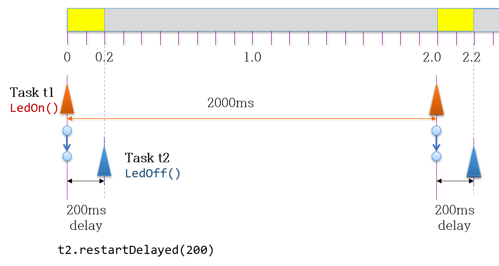

# A Simple Blink Example using Three Tasks
- Use TaskScheduler Library
  - one for turning LED on at regular period (default = 2000ms)
  - the other for turning LED off with 200ms delay
  - the third one is used to adjust the period using the serial input

- Timing Diagram

