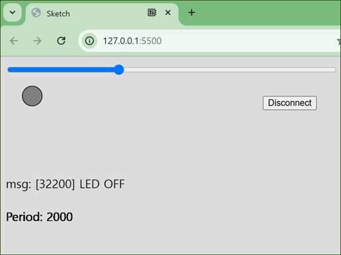

# 아두이노와 WebSerial을 통해 Blink 주기를 제어하기 위한 스크립트
- 슬라이더: Blink 주기를 설정, 0.5초 ~ 5초, 10ms 간격으로 설정
- 아두이노 연결 버튼: 시리얼 포트 연결, 또는 해제
- 원: LED의 상태를 나타냄, On / Off
- 수신 메시지: 아두이노로부터 받은 시리얼 메시지를 나타냄
- 주기 정보: 현재 설정된 blink 주기

